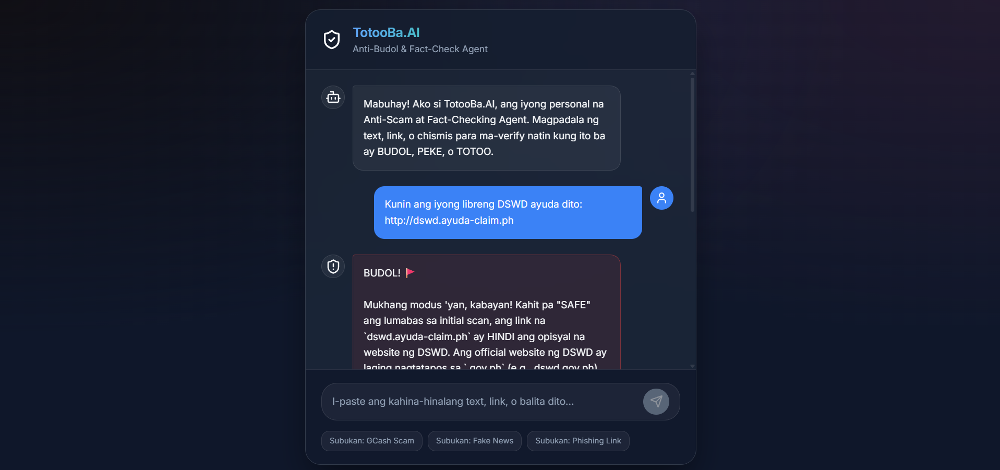
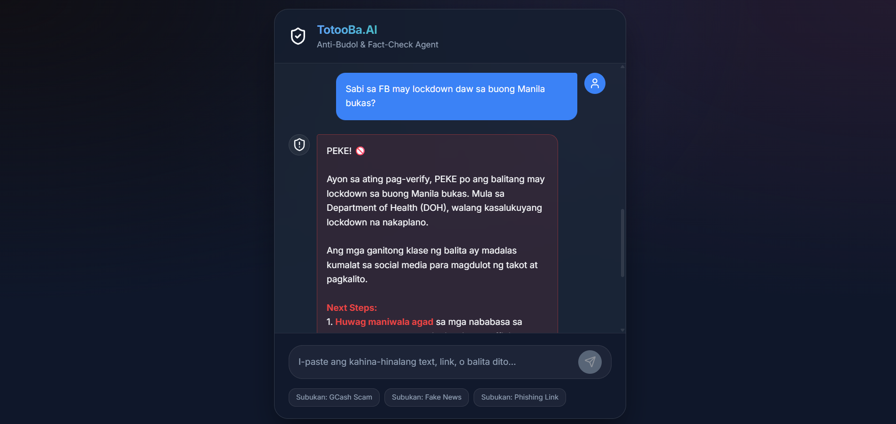
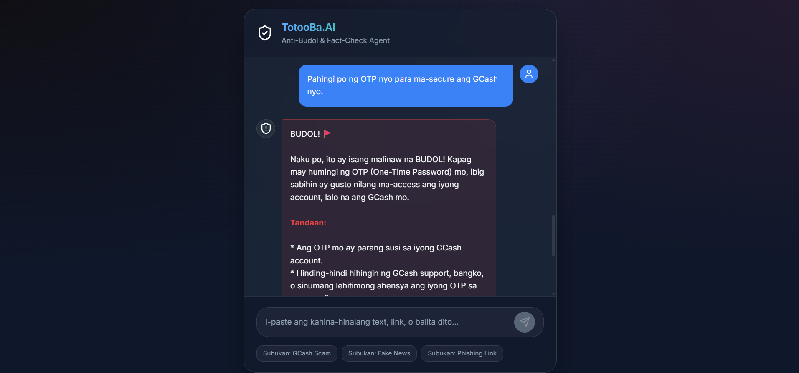

# 🛡️ TotooBa.AI

The Anti-Budol & Fact-Check Agent for the Filipino Netizens

## About The Project
TotooBa.AI is a hyper-local, agentic AI assistant built specifically for the Build with AI Manila 2026 Challenge. It was designed to solve a unique and rampant problem in the Philippines - the spread of digital scams ("budol"), phishing links, and fake news.

Every day, Filipinos - especially the elderly and vulnerable - are targeted by GCash text scams, fake DSWD "ayuda" links, and dangerous health misinformation. Global AI models often fail to detect these because they do not understand Taglish, local cultural context, or the specific Modus Operandi of local scammers.

TotooBa.AI solves this by acting as your personal, easy-to-use fact-checker.

## Key Features
*   Hyper-Local Understanding - Speaks in clear, authoritative Taglish to easily explain complex threats to the average Filipino.
*   Agentic Orchestration - TotooBa.AI does not just guess. It actively uses specific tools to verify information:
    *   scan_url - Analyzes suspicious links for known phishing domains (e.g., fake GCash login pages).
    *   search_local_fact_checks - Cross-references claims with trusted local sources like DOH, PNP, and legitimate news outlets.
    *   analyze_scam_pattern - Detects classic Filipino scam vectors (e.g., false urgency, asking for OTPs).
*   Instant Verdicts - Clearly labels submissions as TOTOO (True), PEKE (Fake News), or BUDOL (Scam) with simple, actionable next steps.

## App Interface & Flow

TotooBa.AI features a premium, responsive glassmorphism UI designed for simplicity. Users just paste the suspicious text or link into the chat.

### 1. The Dashboard
A clean, accessible chat interface where users can interact with the agent.

### 2. Detecting Phishing Links (Budol)
When a user submits a fake link (e.g., a fake DSWD Ayuda site), the Agent scans the URL and warns the user.

### 3. Fact-Checking Fake News (Peke)
The Agent cross-references rumors (like unannounced lockdowns) with official sources like the DOH.

### 4. Analyzing Scam Texts (OTP Scams)
The Agent immediately flags texts asking for OTPs or sensitive credentials as high-risk scams.

## Technology Stack
*   AI Engine - Google Gemini 3.1 Pro (utilizing advanced Function Calling and Agentic capabilities)
*   Frontend - React (Vite) and TypeScript
*   Styling - Pure CSS with Glassmorphism aesthetics

## Hackathon Alignment (Local Impact Explorer)
*   Practical Solution - Addresses a massive, daily pain point for millions of Filipinos.
*   Technical Depth - Showcases complex Gemini tool-calling orchestration to actively seek out facts rather than hallucinating answers.
*   UX & Aesthetics - Delivers a frictionless "Time-to-Value" experience with a modern interface.

Built for Build with AI Manila 2026. "Orchestrate the Future. Ship the Agent."
